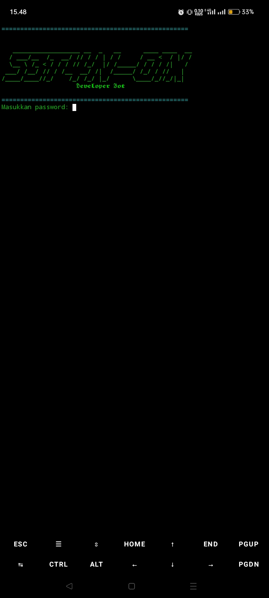
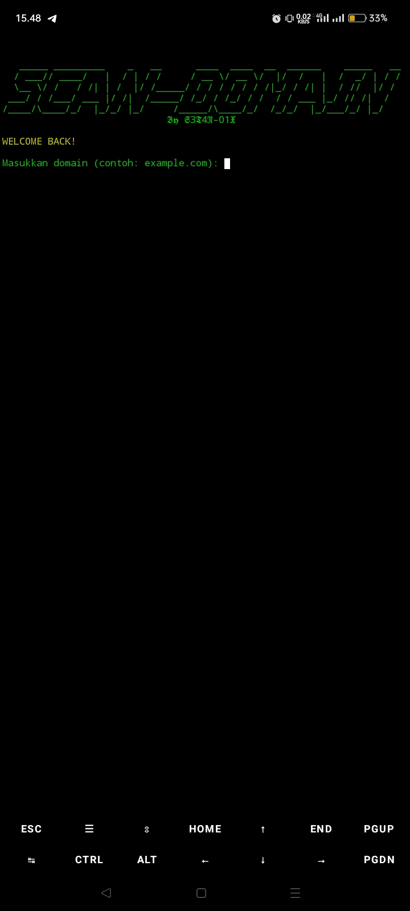

# Scanner

Scanner is a Python-based tool for performing various domain scans such as WHOIS lookup, DNS lookup, email harvesting, and social media presence checks.

## Features
- Whois Scan: Retrieve domain registration data
- DNS Scan: View different DNS record types
- Email Harvester: Extract email addresses from website pages
- Social Media Scan: Check for related social media accounts linked to the domain

## System Requirements
- Python 3.7 or higher
- Compatible with Windows, Linux, macOS, or Termux (with appropriate configuration)

## Installation

1. Clone this repository:

   ```bash
   git clone https://github.com/s3t4n-01x/Scanner.git
   cd Scanner

2. (Optional but recommended) Create and activate a virtual environment:

python -m venv venv
source venv/bin/activate    # For Linux/macOS
venv\Scripts\activate       # For Windows


3. Install dependencies from requirements.txt:

pip install -r requirements.txt


4. Ensure the config.conf file contains the password in this format:

PASSWORD=yourpassword

Example:

PASSWORD=admin123


Usage

1. Run the program:

python main.py


2. Enter the password as set in config.conf.


3. Input the domain you want to scan, for example example.com.


4. Choose the scan menu you want to use (Whois, DNS, Email Harvester, Social Media).


5. Follow the prompts until completion.


##Troubleshooting

If you encounter DNS errors related to resolv.conf on Termux or Linux, make sure /etc/resolv.conf exists and contains DNS servers, or adjust the DNS settings manually in the dns_scan function as needed.

If modules are missing, verify dependencies are installed correctly (pip install -r requirements.txt).

## License
MIT License

---

## Screenshots





## Donasi
wallet
TRC20: TD8Eb9SWSYLsyQ3b6AdGcG64fSQ7ESnB34